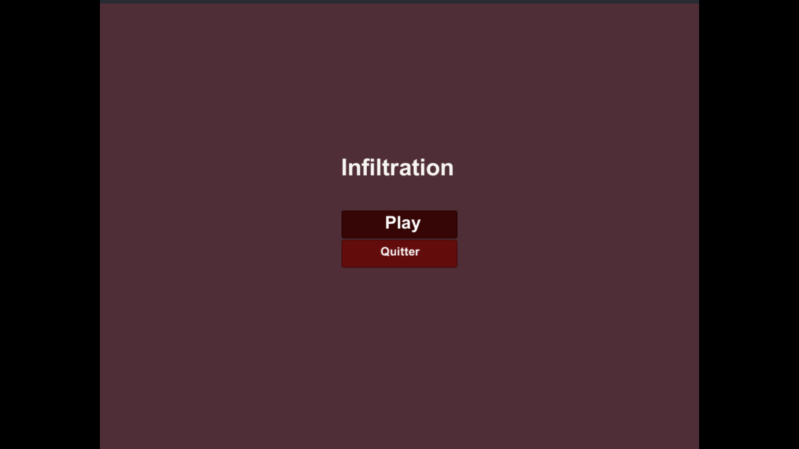
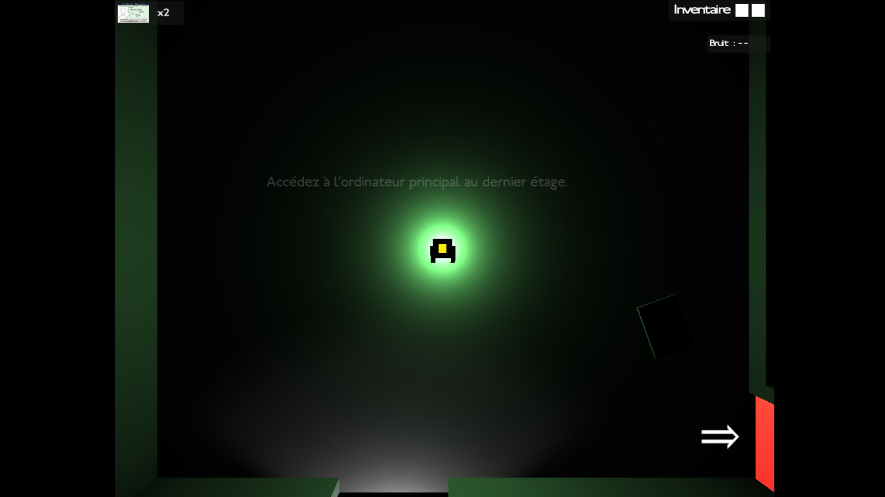
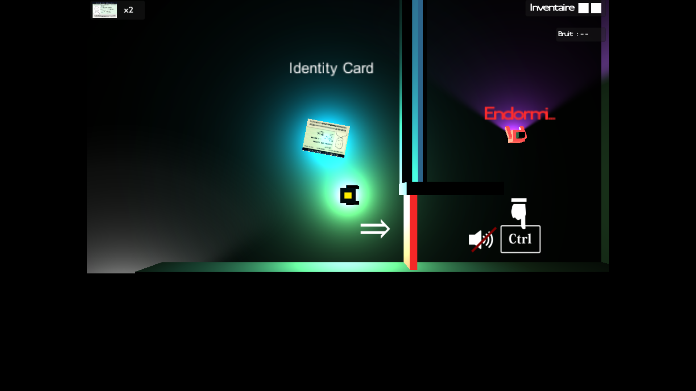
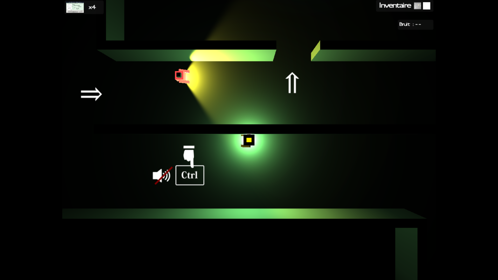
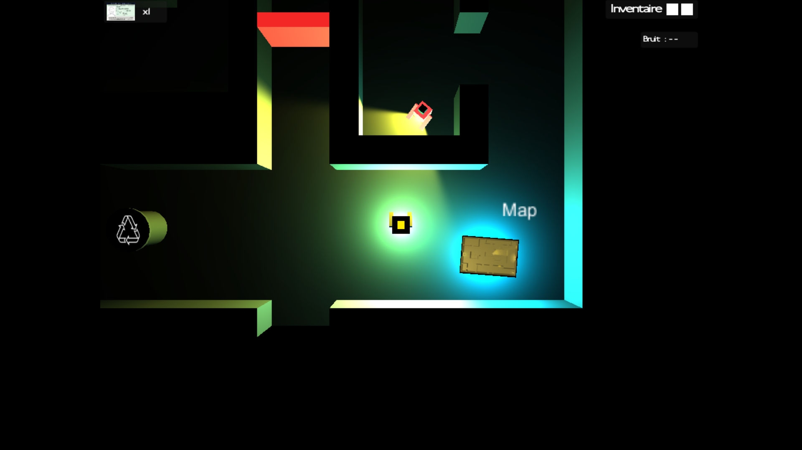
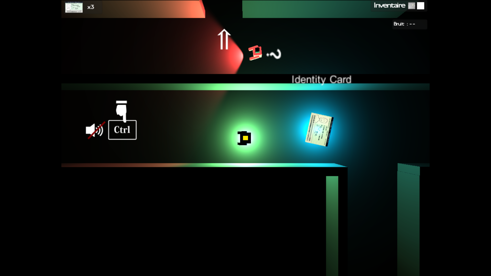
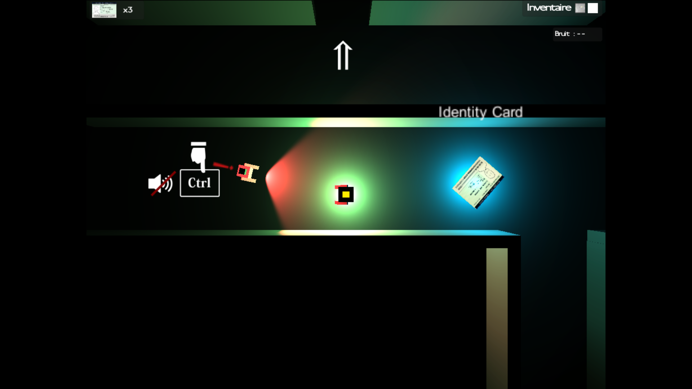
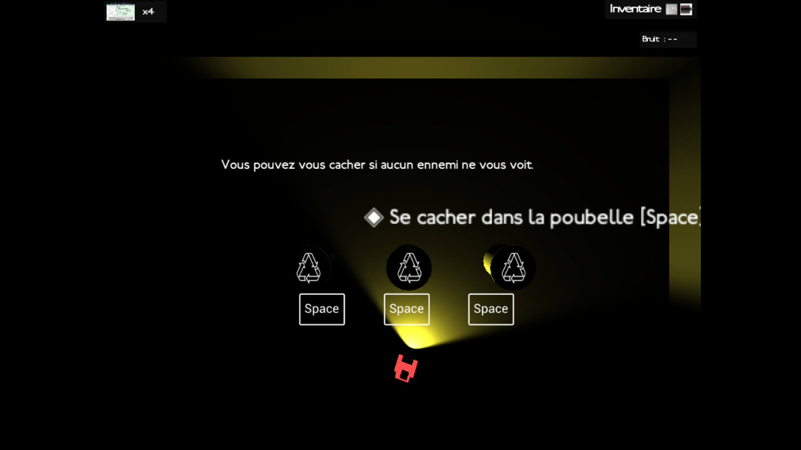

# 🕵️ Infiltration

## 🌍 Multilingual README Versions

| 🇫🇷 Français | 🇬🇧 English | 🇪🇸 Español |
|-------------|------------|------------|
| Vous êtes ici ! | [README.md](./README.md) | [README.es.md](./README.es.md) |

---

## 📘 Vue d’ensemble du projet

Ce projet a été réalisé en **deuxième année de France DUT Informatique** à l’**IUT de Montreuil** en 2016. Il s'agissait du projet final pour le cours de **Jeux Vidéo**.

Nous étions une équipe de **4 étudiants**. L'objectif était de concevoir un jeu d'infiltration complet sous **Unity** en utilisant le langage **C#**.

> ⚠️ Le jeu est **exclusivement disponible en français**.

---

## 🎭 L'Histoire : "L'idée volée"

Vous passez un entretien de stage chez **Woodle**, une entreprise technologique de renom. Durant l'entretien, vous leur présentez une idée révolutionnaire de projet. 

L'entreprise décide de ne pas vous retenir pour le stage... mais vous découvrez qu'ils ont **volé votre idée** pour la développer eux-mêmes ! 

Injustice ! Vous décidez de vous venger. Votre mission : **s'infiltrer de nuit** dans les locaux de Woodle sous diverses identités secrètes. Votre but ultime est d'accéder au serveur central pour **effacer toute trace de votre projet** et empêcher l'entreprise de s'approprier votre travail.

---

## 🕹️ Présentation du jeu

**Infiltration** mélange narration, stratégie et discrétion :

- **Système d'identités (Vies) :** Vos identités sont vos chances de survie. Si vous vous faites repérer, vous perdez votre couverture et devez revenir sous une **nouvelle identité** pour continuer la mission.
- **Infiltration & Furtivité :**
	- **Visuel :** Évitez les cônes de vision des gardes.
    - **Auditif :** Un système de **bruit** est intégré. Marchez prudemment, car chaque pas trop lourd peut alerter les gardes à proximité.
- **Cachettes tactiques :** Vous pouvez vous cacher dans des **poubelles** pour échapper à la vigilance des gardes, mais attention : cela n'est possible que si aucun ennemi ne vous a déjà repéré !
- **Narration :** Un mode tutoriel scénarisé qui met en scène l'entretien d'embauche et la trahison de l'entreprise.
- **Niveaux variés :** Chaque membre de l'équipe a conçu des défis spécifiques pour tester vos réflexes et votre patience.

### ⚠️ Un défi relevé
Le jeu propose une **difficulté exigeante** :
* **Ennemis sournois :** Certains gardes ont des comportements imprévisibles et ne se laisseront pas contourner facilement.
* **Pas de cachette en cas d'alerte :** Si un ennemi vous a déjà dans son champ de vision, il est trop tard pour se cacher dans une poubelle. Vous devez impérativement rester hors de vue AVANT de chercher un refuge.

---

## ⚙️ Technologies utilisées

- **Moteur de jeu :** Unity (Version 2016)
- **Langage :** C#
- **Plateforme :** Windows (x86)

---

## 💻 Installation et Exécution

### 🚀 Jouer immédiatement (Version Release)

Une version prête à l'emploi (Build) est disponible dans les **Releases** de ce dépôt.

1. Allez dans l'onglet [Releases](https://github.com/Fab16BSB/Infiltration/releases/tag/v1.0).
2. Téléchargez le fichier `Infiltration_Archive.zip`.
3. Décompressez l'archive (contient le `.exe`, le dossier `_Data` et les fichiers de debug `.pdb`).
4. Lancez **infiltration.exe**.

### 🛠️ Ouvrir le projet (Sources)

Pour explorer les scripts ou les scènes :
1. Clonez ce dépôt.
2. Ouvrez le dossier avec **Unity Hub** (version 5.x recommandée pour la compatibilité).

---

## ⌨️ Commandes et Contrôles

Le jeu offre une grande flexibilité pour s'adapter à votre style de jeu, que vous soyez droitier ou gaucher.

### 🏃 Déplacements et Actions
| Action | Touches (Droitier) | Touches (Alternative / Gaucher) |
| :--- | :--- | :--- |
| **Se déplacer** | `Z` `Q` `S` `D` | `Touches Directionnelles` (↑ ← ↓ →) |
| **Courir** | `Shift Gauche` | `Shift Droit` |
| **Ralentir / Discrétion** | `Ctrl Gauche` | `Ctrl Droit` |
| **Ouvrir une porte** | `Espace` | `Espace` |

> 💡 **Astuce :** Courir génère beaucoup de bruit (`XX`), tandis que marcher en maintenant `Ctrl` vous permet d'être totalement silencieux (`--`).

### 🎧 Immersion Sonore
Le jeu intègre une **ambiance sonore complète**. Le son est un élément de gameplay à part entière : écoutez bien les bruits de pas des gardes et les alarmes pour anticiper le danger !

### 🚪 Comment quitter le jeu
* **Méthode recommandée :** Utilisez le raccourci `Ctrl` + `Alt` + `Tab` pour sortir de la fenêtre et fermez l'application manuellement.

---

## 🎮 Aperçu du gameplay

### Menu Principal
L'interface d'accueil du jeu permettant de lancer la mission d'infiltration.

---

### Phase de Tutoriel
Le jeu commence par une phase narrative et d'apprentissage des bases de l'infiltration.

*Objectif : Accédez à l'ordinateur principal au dernier étage.*

*Apprentissage de la gestion du bruit et de la récupération d'objets clés comme les cartes d'identité.*

---

### Infiltration et Surveillance
Une fois dans les locaux de Woodle, la vigilance est de mise. Les gardes patrouillent avec des cônes de vision dynamiques dont la couleur indique leur état d'alerte.

*Esquivez le champ de vision des gardes pour ne pas griller votre identité.*

*Recupérer la carte pour révéler l'emplacement des objets à proximité.*

---

### 👮 Comportement des ennemis

Le système de détection repose sur une gestion avancée de la vision et de l'audition des gardes. Soyez attentif à la couleur de leur faisceau et aux icônes d'alerte :

* **Patrouille (Faisceau Jaune) :** L'état normal du garde. Il suit son chemin prédéfini sans se douter de votre présence.
* **Suspicion Sonore (Faisceau Rouge + `?`) :** Les gardes sont sensibles au bruit (marqué par un `X` ou `XX` sur votre ATH). S'ils entendent un son, ils abandonnent leur patrouille pour se rendre immédiatement à la **position exacte** du bruit pour enquêter.
* **Détection Visuelle (Faisceau Rouge + `!`) :** Si vous entrez dans le champ de vision d'un garde, il vous identifie formellement. Votre identité actuelle est compromise et vous perdez une "vie".
* **Sommeil (Faisceau Violet) :** Vous pouvez croiser des gardes endormis. Ils ne voient rien, mais restez discret car ils peuvent se réveiller à tout moment !

### 📸 États d'alerte en images

  
*Le faisceau rouge accompagné d'un **?** indique que l'ennemi a entendu un bruit suspect et se déplace pour vérifier la zone concernée.*

  
*Le faisceau rouge accompagné d'un **!** signale une détection visuelle immédiate : vous avez été repéré.*

---

### Système de Cachettes
Une mécanique essentielle pour survivre, soumise à des conditions strictes.

*Vous pouvez vous cacher dans les poubelles, mais uniquement si vous n'êtes pas déjà dans le champ de vision d'un ennemi.*

---

### Détails de l'ATH (Interface)
L'interface en jeu affiche des informations cruciales pour votre survie :

* **Identités (Vies) :** Situées en haut à gauche, elles indiquent le nombre de couvertures restantes avant l'échec de la mission.
* **Indicateur de Bruit :** Situé en haut à droite, il évolue selon vos actions :
    * `--` : Vous êtes parfaitement silencieux.
    * `X` : Bruit léger, attention aux gardes proches.
    * `XX` : Bruit important, vous risquez d'alerter toute la zone.
* **Inventaire :** Permet de visualiser vos objets de quête et cartes d'accès en temps réel.

---

## 🧑‍💻 L'Équipe

Nous avons travaillé à 4 sur ce projet avec la répartition suivante :

- **Boris Eng** : Co-auteur de l'histoire, création du tutoriel et réalisation de l'intégralité des décors.
- **Thomas Dunglas** : Création de l'ATH (Interface Utilisateur) et conception d'un niveau complet.
- **Lucas** : Conception et design d'un niveau complet.
- **Moi** : Co-auteur de l'histoire, création du tutoriel et mécaniques de gameplay.

---

## 🙌 Remerciements

Je souhaite remercier mes enseignants de l'IUT de Montreuil pour m'avoir proposé ce projet ainsi que pour leurs précieux conseils techniques durant ce cursus.